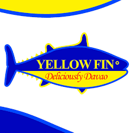

## Yellow Fin Tuna
Seafood continues to be one of Davao City's distinctive food offers despite the advent of many cuisines and food specialties. There are several eateries in the city that provide seafood, but Yellow Fin Tuna Restaurant is among the most well-known.

## Framework Used

* Drupal

## Order System

The order system begins when customers place an order and ends when they receive their product. It enables a company to manage all aspects of order fulfillment, including order gathering, inventory management, delivery tracking, and service availability. An order's lifecycle can also be managed digitally. It records all data and operations, such as order entry, inventory control, order fulfillment, and post-sales support. The company and the customer have transparency, thanks to an order system. Customers can monitor the status of orders, and businesses can access almost real-time inventory information. Depending on a company's demands, the workflow can vary; however, a typical order system process consists of the following steps:

* Placement of order by the customers

	_The customer places the order. A sales team member checks the details and confirms the order._
	
* Fulfillment

	_The warehouse employee verifies the shipping information, creates an invoice, and completes the order—picking, packing, and shipping._

* Inventory Management

	_Inventory levels are tracked because they change in response to business demands._
	

Sub-systems:

1. **Customer**

2. **Customer Service Rep**

3. **Inventory System**

5. **Credit System**

7. **Order History**

